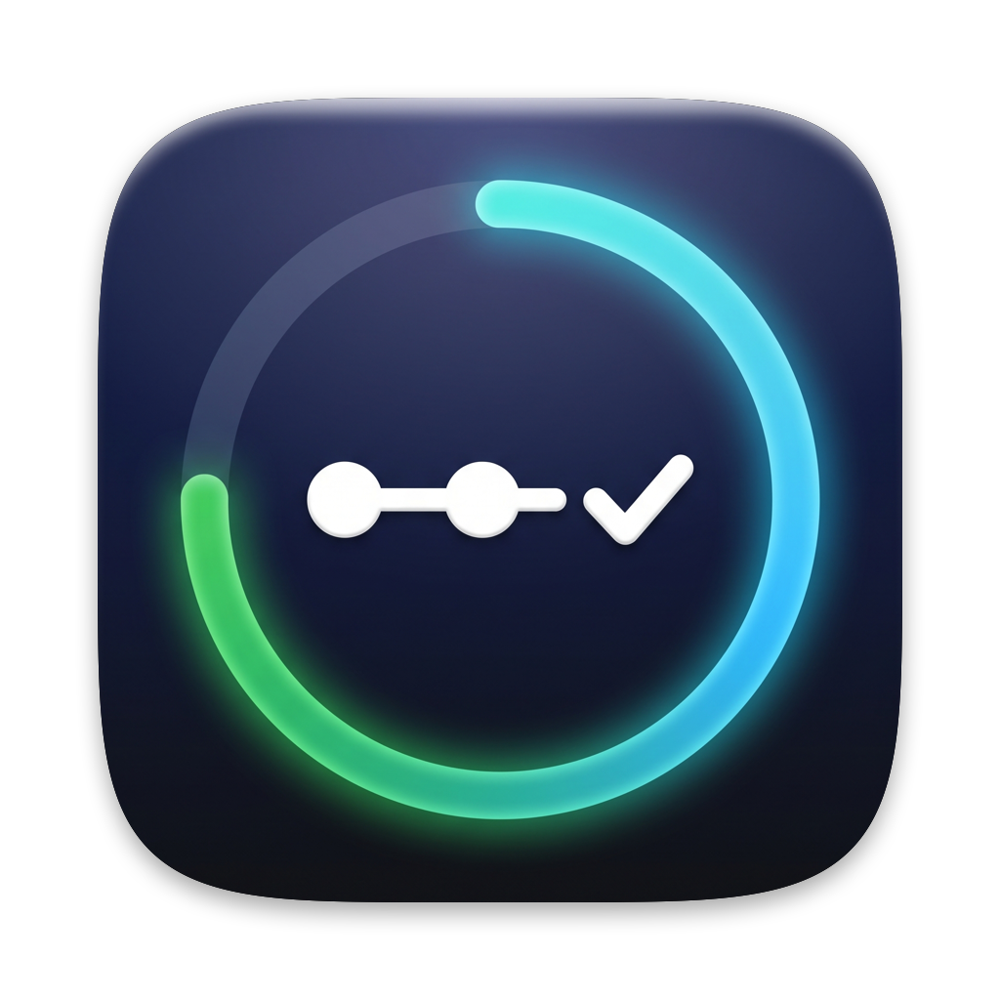

<p align="center"></p>

# ActionsBar

A lightweight macOS menu bar app that shows the live progress of your running GitHub Actions workflows.

- **In the menu bar**: a progress ring and percentage (`63%`, or `2 · 63%` when several runs are going). When idle, a ✓ / ✗ icon shows the result of the last run.
- **In the panel**: running workflows with repository, branch, progress bar, elapsed time, estimated time left and per-job detail with the current step. Recently finished runs are listed below. Click any run to open it on GitHub.
- **Notifications** when a workflow finishes (click to open the run).
- **Launches at login** by default (can be turned off in the settings).

> The interface is currently in French.

## Requirements

- macOS 14 or later
- Xcode / Swift 6 to build
- The [GitHub CLI](https://cli.github.com) logged in (`gh auth login`), or a personal access token

## Install

```sh
git clone https://github.com/cldt-fr/github-actions-bar-mac.git
cd github-actions-bar-mac
make install   # builds ActionsBar.app and copies it to /Applications
```

Other commands:

```sh
make run       # build the .app into build/ and open it
make build     # debug build (swift build)
swift run      # quick run without an app bundle (no notifications)
```

## How it works

- **Authentication**: uses the token from `gh auth token` by default. A token entered in the settings (stored in the Keychain) takes precedence. It needs the `repo` scope (and `read:org` for organization repositories).
- **Watched repositories**: by default the 15 repositories you pushed to most recently (personal and organizations), plus any `owner/name` added in the settings. The list is refreshed every 5 minutes.
- **Polling**: every 5 s while a run is in progress, every 30 s otherwise (configurable). Requests use ETags, so unchanged responses (304) don't count against the API rate limit.
- **Progress**: each job's progress is its ratio of completed steps; a run's progress is the average of its jobs. The time left is estimated from the duration of the last successful run of the same workflow.

## Trying it out

The repository ships a dummy workflow that takes about 3 minutes:

```sh
gh workflow run demo.yml -R <owner>/github-actions-bar-mac
gh workflow run demo.yml -R <owner>/github-actions-bar-mac -f fail=true   # ends in failure
```

## Project layout

| File | Role |
| --- | --- |
| `Sources/ActionsBar/RunStore.swift` | Polling loop, progress, completion notifications |
| `Sources/ActionsBar/GitHubClient.swift` | GitHub REST client with ETag caching |
| `Sources/ActionsBar/MenuContentView.swift` | Panel UI |
| `Sources/ActionsBar/SettingsView.swift` | Settings UI |
| `Sources/ActionsBar/ActionsBarApp.swift` | App entry point and menu bar label |
| `scripts/bundle.sh` | Builds the universal `.app` bundle |

## Contributing

Issues and pull requests are welcome.

## License

[MIT](LICENSE)
